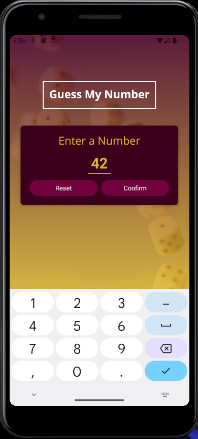
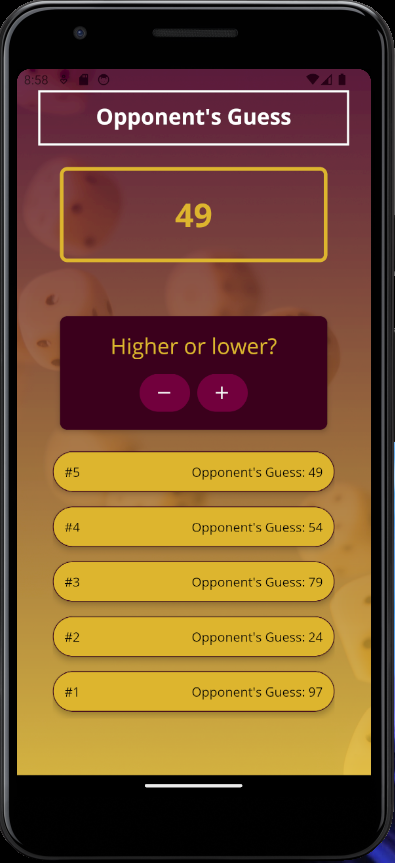
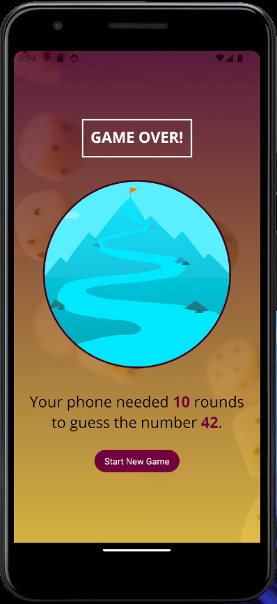

# Number Guess - React Native 

  ## Description

  A game where the user selects a random number and their device (i.e.mobile phone) attempts to guess the number.  When the device guesses a number, the user responds whether actual number is higher or lower than the guessed number.

  ### App Screenshots:

  #### Home Screen:

  

  #### Guess Screen:
  
  

  #### Game Over Screen:

  
  
  ## Table of Contents
  
  - [Installation](#installation)
  - [Usage](#usage)
  - [License](#license)
  - [Contributing](#contributing)
  - [Tests](#tests)
  - [Questions](#questions)
  
  ## Installation
  
  type 'npm install' in the command line.  Then run program in an Android or iPhone emulator (i.e. Android Studio for Android or Expo app or Xcode for iPhone)
  
  ## Usage
  
  Pick a random number.  Device (i.e. mobile phone) will then guess a number. Then  respond with whether actual number is higher or lower than the guessed number. Repeat until the actual number has been guessed by your device.

  ## License
This application is covered under the MIT License.
 For more information: https://opensource.org/licenses/MIT
  
  ## Contributing
  N/A
  
  ## Tests
  N/A

  ## Questions
  Contact Info 
  GitHub user name: BillStephens2022 
  Link to GitHub profile: https://github.com/BillStephens2022 
  Email: stephensbill17@gmail.com
